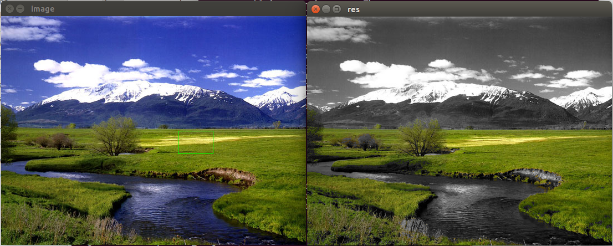
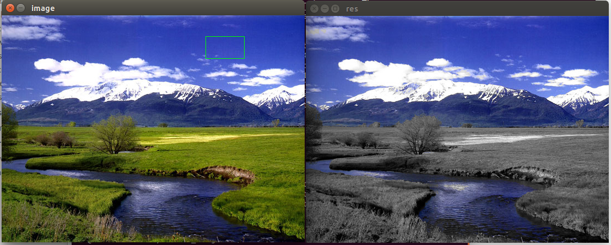

# USAGE
  
    python color_picker.py scen.jpg

# METHODS
  
  - inRange() http://docs.opencv.org/3.0-beta/modules/core/doc/operations_on_arrays.html?highlight=cv2.inrange#cv2.inRange
  - setMouseCallback() http://docs.opencv.org/3.0-beta/modules/highgui/doc/user_interface.html?highlight=setmousecallback#cv2.setMouseCallback
  - bitwise_and() http://docs.opencv.org/3.0-beta/modules/core/doc/operations_on_arrays.html?highlight=bitwise_and#cv2.bitwise_and

# RESULTS

 
 

